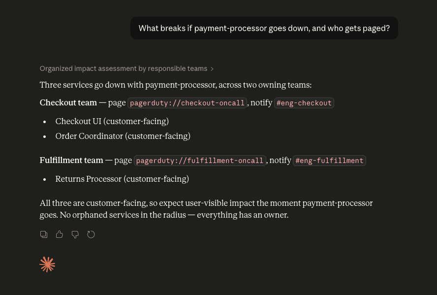
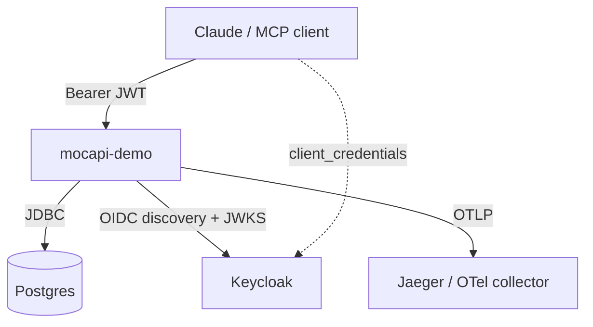
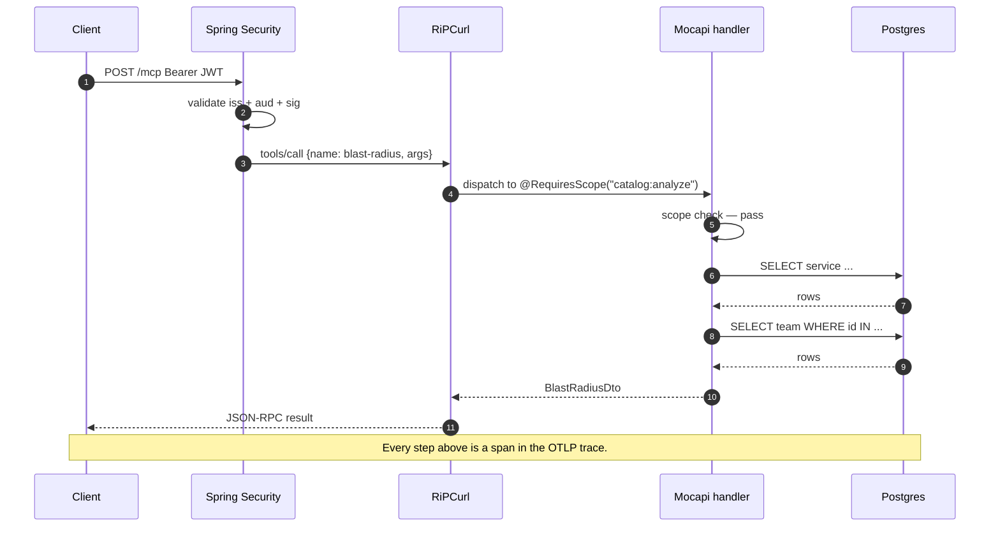

# Mocapi Demo

[](LICENSE)
[](https://github.com/callibrity/mocapi-enterprise-demo/pkgs/container/mocapi-enterprise-demo)

[](https://sonarcloud.io/summary/new_code?id=callibrity_mocapi-enterprise-demo)
[](https://sonarcloud.io/summary/new_code?id=callibrity_mocapi-enterprise-demo)
[](https://sonarcloud.io/summary/new_code?id=callibrity_mocapi-enterprise-demo)
[](https://sonarcloud.io/summary/new_code?id=callibrity_mocapi-enterprise-demo)
[](https://sonarcloud.io/summary/new_code?id=callibrity_mocapi-enterprise-demo)

An **enterprise-grade MCP server** built on Spring Boot 4, [Mocapi](https://github.com/callibrity/mocapi), and GraalVM native. Exposes a fictitious service catalog ("Meridian") over the Model Context Protocol so an LLM can answer the kinds of questions every enterprise engineering org struggles with:

- **Who owns this service?** What happens if it breaks?
- **Which services touch PII / PCI?** Are any of them orphaned?
- **What's our deprecation debt?** Which legacy services are still being called, and by whom?
- **If we sunset this team, what are we on the hook for?**

The point isn't the catalog. The point is what sits around it: OAuth2 with RFC 8707 resource indicators, scope-gated tool visibility, three-pillar OpenTelemetry, persistent encrypted sessions, native-compilable everything — the patterns real MCP deployments need but toy examples skip.

**How to use this repo.** For *how Mocapi works* — tool dispatch, schema generation, the streamable HTTP transport, bean validation mechanics, MDC correlation, Observation-to-OTel bridging — read the [Mocapi docs](https://github.com/callibrity/mocapi). This repo picks up where those leave off: it shows the **enterprise wrapper** you build around Mocapi when you're taking MCP from a toy to a deployment.

---

## Seeing it in action

One natural-language question, and Claude works the catalog the way a human would — only without the tab-hopping:



The user asked in English. The LLM picked the right tools (`blast-radius` plus `team-lookup` for the on-call handles) and came back with a structured answer you could act on — teams to notify, PagerDuty handles to page, Slack channels to loop in, and an orphan check confirming no unowned services in the radius. The same question normally means 20 minutes of digging through Confluence, the service registry, PagerDuty, and Slack; here it's one prompt.

Or harder questions — the kind a compliance audit asks — where the "right answer" isn't in any single system:


Notice the LLM cross-referenced three different tool outputs (tag-filtered listing, orphan detection, blast-radius) and reframed the answer around the *actual* risk — compliance, not availability — with a concrete recommendation. The catalog data is the raw material; the LLM is the analyst.

That's the payoff. The rest of this README is about the enterprise wrapper that makes this safe to run in production: OAuth2 with audience binding so only authorized clients get there, scope-gated tools so different users see different tool rosters, encrypted sessions so the transcript is safe at rest, and full OTLP observability so you can see exactly which tool calls the LLM made on which session for which user.

---

## Quickstart

On a fresh clone, run each block in order:

**1. Run the app.** `spring-boot-docker-compose` starts Postgres, Keycloak (with realm pre-imported), and Jaeger from `compose.yaml` on boot and stops them on shutdown — no separate compose step needed. Ephemeral encryption keys are generated on first boot.

```bash
mvn spring-boot:run
```

**2. Mint a token as the `oncall` persona:**

```bash
TOKEN=$(curl -sS -X POST http://localhost:8180/realms/mocapi-demo/protocol/openid-connect/token \
  -d 'grant_type=client_credentials&client_id=meridian-oncall&client_secret=meridian-oncall-secret' \
  | jq -r .access_token)
```

**3. Initialize an MCP session — the server mints the id and returns it in the `Mcp-Session-Id` response header:**

```bash
SESSION=$(curl -sS -D - -o /dev/null -X POST http://localhost:8080/mcp \
  -H "Authorization: Bearer $TOKEN" \
  -H 'Content-Type: application/json' \
  -H 'Accept: application/json, text/event-stream' \
  -d '{"jsonrpc":"2.0","id":1,"method":"initialize","params":{"protocolVersion":"2025-11-25","capabilities":{},"clientInfo":{"name":"curl","version":"0"}}}' \
  | awk 'tolower($1) == "mcp-session-id:" { print $2 }' | tr -d '\r')
```

**4. Complete the handshake (required by the MCP spec):**

```bash
curl -sS -X POST http://localhost:8080/mcp \
  -H "Authorization: Bearer $TOKEN" \
  -H "Mcp-Session-Id: $SESSION" \
  -H 'Content-Type: application/json' \
  -H 'Accept: application/json, text/event-stream' \
  -d '{"jsonrpc":"2.0","method":"notifications/initialized"}'
```

**5. Call a tool:**

```bash
curl -sS -X POST http://localhost:8080/mcp \
  -H "Authorization: Bearer $TOKEN" \
  -H "Mcp-Session-Id: $SESSION" \
  -H 'Content-Type: application/json' \
  -H 'Accept: application/json, text/event-stream' \
  -d '{"jsonrpc":"2.0","id":2,"method":"tools/call","params":{"name":"blast-radius","arguments":{"name":"payment-processor"}}}'
```

Traces land in Jaeger at <http://localhost:16686>. Keycloak's admin console (if you want to poke around the realm) is at <http://localhost:8180>, `admin` / `admin`.

---

## Enterprise pillars

This is the spine of what the demo is trying to show. Each pillar is a pattern enterprises actually need.

### 1. Authorization — OAuth2 + RFC 8707 + scope-gated tool visibility

The `/mcp` endpoint is a Spring Security OAuth2 resource server. Every request carries a JWT; Spring validates signature, issuer, and audience before the MCP handler runs.

Keycloak is the local OIDC provider. Its realm (pre-imported from [`keycloak/mocapi-demo-realm.json`](keycloak/mocapi-demo-realm.json)) defines:

- Three **client scopes** that gate what tools a caller can see and invoke:

  | Scope | Tools unlocked |
  |---|---|
  | `catalog:read` | `service-lookup`, `team-lookup`, `services-list`, `teams-list` |
  | `catalog:analyze` | `blast-radius`, `service-dependencies`, `service-dependents`, `orphaned-services`, `deprecated-in-use` |
  | `feedback:write` | `submit-feedback`, `suggest-tool` |

- Three **personas** (M2M clients) with tiered scope assignments:

  | Persona | Scopes | Tools visible | Real-world analog |
  |---|---|---|---|
  | `meridian-viewer` | `catalog:read` | **4** | Everyday directory user |
  | `meridian-oncall` | `+ catalog:analyze` | **9** | 2am-page responder |
  | `meridian-owner` | `+ feedback:write` | **11** | Catalog maintainer |

Tools are gated by `@RequiresScope("...")` from [`mocapi-spring-security-guards`](https://github.com/callibrity/mocapi/tree/main/mocapi-spring-security-guards). When a caller lacks the required scope, the tool is **hidden from `tools/list`** (not just 403'd on invocation) — the LLM never sees an unusable tool in its schema. Defense in depth: if a client somehow invokes a hidden tool anyway, `@RequiresScope` returns JSON-RPC `-32003 Forbidden`.

**RFC 8707 resource indicators** are supported end-to-end: the audience mapper in Keycloak binds issued tokens to `http://localhost:8080/mcp`, and Spring's resource-server validates the `aud` claim against `spring.security.oauth2.resourceserver.jwt.audiences`. This blocks the token-theft-to-other-resource attacks plain bearer tokens allow.

**Swap to a different IdP** by setting three env vars — no code change, no profile juggling:

```bash
SPRING_SECURITY_OAUTH2_RESOURCESERVER_JWT_ISSUER_URI=https://your-tenant.auth0.com/
SPRING_SECURITY_OAUTH2_RESOURCESERVER_JWT_AUDIENCES=https://mcp.yourcompany.com
SPRING_SECURITY_OAUTH2_RESOURCESERVER_JWT_JWK_SET_URI=https://your-tenant.auth0.com/.well-known/jwks.json
```

### 2. Observability — three pillars via OTLP

Traces, metrics, and logs all leave the app via OTLP. Locally, Jaeger's all-in-one (with `COLLECTOR_OTLP_ENABLED=true`) catches traces on `:4318`. In production, point at the OTel collector of your choice.

- **Traces**: Micrometer Observation → OTel bridge (via `spring-boot-starter-opentelemetry`, transitive through `mocapi-otel`). A single tool call produces a complete flame graph: `http post /mcp` → Spring Security filter chain → `tools/call` (RiPCurl dispatch) → tool span (e.g. `blast-radius`) → JDBC `connection`/`query`/`result-set` spans. N+1 query patterns are visible in the trace, not inferred from logs.
- **Metrics**: Micrometer OTLP meter registry pushes on a 60s cadence. JVM, HTTP, JDBC, Hikari, Mocapi handler metrics all flow.
- **Logs**: Logback → OTel `LogRecord` via `opentelemetry-logback-appender-1.0`, wired at boot by an explicit `OpenTelemetryAppender.install(...)`. MDC keys from `mocapi-logging` (`mcp.session`, `mcp.protocol.version`, `mcp.handler.kind`, `mcp.handler.name`, `mcp.handler.class`, `mcp.request.id`) propagate as log attributes with trace/span correlation.

No OTel Java agent. No bytecode instrumentation. Works under GraalVM native without special handling.

### 3. Persistence — Postgres for everything

Two durable stores, both Postgres:

- **Catalog schema** (service, team, dependency, service_tag) — Liquibase-managed via [`src/main/resources/db/changelog/`](src/main/resources/db/changelog/). Hibernate runs in `ddl-auto=validate`, so drift between entities and schema fails startup instead of silently mutating the DB.
- **Mocapi session state** (substrate_atom, substrate_mailbox, substrate_journal_*, substrate_notifier) — managed by [`substrate-postgresql`](https://github.com/jwcarman/substrate), shares the same `DataSource`. Sessions survive app restarts; the notifier uses Postgres `LISTEN/NOTIFY` for cross-node fan-out.

Two independent AES-256 keys are in play, both bootstrapped ephemerally for local dev by [`EncryptionBootstrap.java`](src/main/java/com/callibrity/mocapi/demo/infra/EncryptionBootstrap.java) (logged in bold red so you know you got one) and overridable via env var for production:

- **`mocapi.session-encryption-master-key`** — Mocapi uses this to encrypt the `streamName:eventId` pair that becomes the SSE `id:` value clients present back as `Last-Event-Id` on `GET /mcp` resume. The ciphertext is opaque to the client and tamper-proof, so a reconnecting client can't forge a stream identity or peek at server-side stream names. Override with `MOCAPI_SESSION_ENCRYPTION_MASTER_KEY`.
- **`substrate.crypto.shared-key`** — Substrate's `AesGcmPayloadTransformer` (from `substrate-crypto`) uses this to encrypt atom / mailbox / journal payloads before they hit Postgres. Rows in `substrate_atom` are ciphertext — a DBA with raw SQL access can't read session state. Supports `shared-kid` for key rotation, or plug in a custom `SecretKeyResolver` bean (KMS / Vault / HSM) for keys that never live in the JVM. Override with `SUBSTRATE_CRYPTO_SHARED_KEY`.

### 4. GraalVM native image

Full native build in ~1.5 min (`mvn -Pnative native:compile` with GraalVM 25). Resulting binary:

- ~210MB on disk, ~100MB resident after warmup
- Starts in ~150ms
- Same Postgres + OAuth2 + OTel + scope guards as the JVM build — nothing strips out under native

Reachability hints for Liquibase XSDs, substrate SQL scripts, and Hibernate's `UUID[]` loader live in [`src/main/resources/META-INF/native-image/`](src/main/resources/META-INF/native-image/).

**Gotcha worth naming:** when `@ConfigurationProperties` binds to a **Spring-framework type** (we bind to `CorsConfiguration` from `spring-web`), native-image can't find its setters at build-time because that type isn't designed as a properties POJO and therefore isn't auto-hinted. Boot fails on the first matching property key. Fix is one annotation on the properties class:

```java
@ConfigurationProperties(prefix = "mocapi.demo")
@RegisterReflectionForBinding(CorsConfiguration.class)
@Data
public class MocapiDemoProperties { … }
```

Your own nested types auto-hint; only cross-library types need this. See [`MocapiDemoProperties.java`](src/main/java/com/callibrity/mocapi/demo/config/MocapiDemoProperties.java).

CI builds the native image via Paketo buildpacks (`spring-boot:build-image`) and pushes to GHCR on every tagged release — see [`.github/workflows/release.yml`](.github/workflows/release.yml).

---

## Architecture

### Deployment



### Request flow (single MCP tool call)



---

## Feature tour — Mocapi & Substrate

The "Enterprise pillars" section above is the elevator pitch. This section is the inventory: for every Mocapi or Substrate module on our classpath, what it does, the dependency that brings it in, and the exact place in this repo we exercise it.

### `mocapi-streamable-http-spring-boot-starter` — the `/mcp` endpoint

Auto-configures the MCP *streamable HTTP* transport: a single `/mcp` path that handles `POST` (JSON-RPC requests), `GET` (SSE streams for server-initiated notifications and stream resume), and `DELETE` (session termination). The starter also manages session ids (minted server-side and returned in the `Mcp-Session-Id` response header) and SSE event id framing.

**What it buys you.** The entire MCP wire protocol — initialize handshake, capability negotiation, `tools/list`, `tools/call`, notifications, progress tokens, SSE resume via `Last-Event-Id` — dropped in as auto-config. Nothing in this repo implements transport.

**SSE resume-token encryption.** When Mocapi hands an SSE event id back to the client, the `streamName:eventId` pair is encrypted with `mocapi.session-encryption-master-key` into one opaque token. On reconnect (`GET /mcp` with `Last-Event-Id`), Mocapi decrypts and re-attaches the client to the right stream at the right position. Clients can't forge, peek, or replay across streams. The key is bootstrapped ephemerally in [`EncryptionBootstrap.java`](src/main/java/com/callibrity/mocapi/demo/infra/EncryptionBootstrap.java) for local dev.

### `mocapi-oauth2` — OAuth2 resource server + RFC 8707

Auto-configures the `/mcp` endpoint as a Spring Security OAuth2 resource server with RFC 8707 audience binding. Transitively pulls in `spring-boot-starter-oauth2-resource-server`, so we don't declare that ourselves. Also serves [`/.well-known/oauth-protected-resource`](https://datatracker.ietf.org/doc/html/rfc9728) so MCP clients can discover the authorization server without hard-coding it.

**What it buys you.** Signature validation, issuer validation, audience validation, JWKS caching, and the spec-correct discovery metadata — all from three properties:

```properties
spring.security.oauth2.resourceserver.jwt.issuer-uri=http://localhost:8180/realms/mocapi-demo
spring.security.oauth2.resourceserver.jwt.audiences=http://localhost:8080/mcp
spring.security.oauth2.resourceserver.jwt.jwk-set-uri=http://localhost:8180/realms/mocapi-demo/protocol/openid-connect/certs
```

See [`application.properties`](src/main/resources/application.properties). Mocapi 0.10+ auto-derives `mocapi.oauth2.resource` from the configured audience, so there's no second place to update when the audience changes.

### `mocapi-jakarta-validation` — Bean Validation on tool arguments

Plugs Jakarta Bean Validation into tool / prompt / resource handler dispatch. Annotations on `@McpTool` parameters (`@NotBlank`, `@Pattern`, `@Size`, `@Min`, `@Max`, …) are enforced before the handler method runs. Violations in tool handlers surface as `CallToolResult.isError=true` with violation detail in the message content — which is the LLM-self-correction path. Violations in prompt or resource handlers surface as JSON-RPC `-32602` with a structured `{field, message}` list.

**How we use it.** Every tool parameter in [`CatalogTools.java`](src/main/java/com/callibrity/mocapi/demo/catalog/mcp/CatalogTools.java) is constrained:

```java
@RequiresScope("catalog:read")
@McpTool(name = "service-lookup", title = "Service Lookup",
    description = "${tools.catalog.service-lookup.description}")
public ServiceDto serviceLookup(
    @Schema(description = "Short name of the service, e.g. 'payment-processor'")
        @NotBlank @Size(max = 100) @Pattern(regexp = "^[a-z0-9-]+$")
        String name) {
  return catalog.lookupService(name);
}
```

**What it buys you.** Validation lives on the parameter, next to the type — same place the tool schema sees it — so the LLM gets an accurate JSON Schema *and* malformed calls never reach handler code.

### `mocapi-spring-security-guards` — scope-gated tool visibility

Supplies `@RequiresScope` / `@RequiresRole`. The guards hook into Mocapi's schema advertisement path: a tool annotated with `@RequiresScope("catalog:analyze")` is **hidden from `tools/list`** for callers whose token doesn't carry that scope. It never appears in the LLM's tool schema, so the LLM can't try to use it.

Defense-in-depth: if a client somehow invokes a hidden tool anyway (forged request, stale schema), the same annotation is enforced at invocation and returns JSON-RPC `-32003 Forbidden`.

**How we use it.** Tiered scopes across tool classes, e.g.

```java
@RequiresScope("catalog:analyze")
@McpTool(name = "blast-radius", …)
public BlastRadiusDto blastRadius(@NotBlank String name) { … }
```

See the scope / persona / tool-count matrix in the "Enterprise pillars" section for the full mapping.

**What it buys you.** The LLM's tool roster stays a function of the caller's identity — not of hand-authored allow/deny lists maintained elsewhere. Adding a new tool means picking a scope; nothing else to wire.

### `mocapi-logging` — MDC correlation on every handler

Wraps every tool / prompt / resource handler invocation in an SLF4J MDC scope that stamps:

| Key | Value |
|---|---|
| `mcp.session` | Session id (UUID) |
| `mcp.protocol.version` | Negotiated MCP protocol version (e.g. `2025-11-25`) |
| `mcp.handler.kind` | `tool` / `prompt` / `resource` / `resource_template` |
| `mcp.handler.name` | Tool/prompt name, or resource URI / resource-template URI template |
| `mcp.handler.class` | Simple name of the (AOP-unwrapped) Java class hosting the handler |
| `mcp.request.id` | JSON-RPC request id for the in-flight call (absent for notifications) |

**How we use it.** [`logback-spring.xml`](src/main/resources/logback-spring.xml) forwards these MDC keys into the OTel logback appender, which turns them into log-record attributes. The result: every log line the handler emits (including user code) is searchable in the logging backend by session, handler kind, or handler name, correlated with the active trace/span ids.

**What it buys you.** "Which session made the LLM hallucinate?" becomes a log query, not a memory archaeology expedition.

### `mocapi-otel` — Observation wrapper on every handler

Bundles `mocapi-o11y` (which wraps every handler invocation in a Micrometer `Observation`) with Spring Boot 4's `spring-boot-starter-opentelemetry` (which in Spring Boot 4 is the dep that activates `MicrometerTracingAutoConfiguration` and registers the `DefaultTracingObservationHandler` that bridges Observations to OTel spans). The net effect: every tool call is a named span (e.g. `blast-radius`) with its own attributes, nested under the HTTP request span.

Combined with `datasource-micrometer-spring-boot` + `datasource-micrometer-opentelemetry` (both on our classpath — see [`pom.xml`](pom.xml)), every JDBC statement also becomes an OTel span with `db.query.text`, `db.system.name`, `db.operation.name`, and `db.response.returned_rows` attributes. Which means N+1 patterns are visible in Jaeger as a fan of query spans under a single handler span.

**What it buys you.** No OTel Java agent, no bytecode instrumentation, no custom `@Traced` annotations. One starter, one observability pipeline, works under GraalVM native.

### `mocapi-actuator` — `/actuator/mcp` inventory endpoint

Adds a read-only Spring Boot Actuator endpoint that enumerates every registered tool, prompt, and resource — names, titles, descriptions, input/output schema digests, scope requirements. Ops can see what a running build exposes without opening an MCP session or hitting the LLM.

**How we use it.** One-line opt-in in [`application.properties`](src/main/resources/application.properties):

```properties
management.endpoints.web.exposure.include=health,info,mcp
```

**What it buys you.** Deployment verification (`curl /actuator/mcp | jq '.tools[].name'`) and schema-drift detection (diff the digests across builds) without any custom scaffolding.

### `substrate-postgresql` — persistent MCP session state

Mocapi's session state (atoms, mailboxes, journals, cross-node notifications) is an abstract interface (`substrate-api`) with pluggable backends. We use the Postgres backend: four tables (`substrate_atom`, `substrate_mailbox`, `substrate_journal_entries`, `substrate_journal_completed`) sharing the app's primary `DataSource`, plus Postgres `LISTEN`/`NOTIFY` for cross-node fan-out in the notifier.

**What it buys you.**

- **Sessions survive restarts.** Pod rolls, in-flight sessions stay put.
- **Horizontal scale.** Any replica can serve any session; the `LISTEN`/`NOTIFY`-based notifier wakes the right replica when a message lands in a mailbox.
- **No extra infra.** One Postgres — same connection pool as the catalog schema. Nothing new for ops to run.

Auto-create-schema flags (`substrate.atom.auto-create-schema`, etc.) default to `true` so tables appear on first boot; flip to `false` in prod once DBAs own the schema.

### `substrate-crypto` — AES-GCM encryption at rest

Auto-configures `AesGcmPayloadTransformer`, which Substrate invokes before writes and after reads. With it on the classpath and `substrate.crypto.shared-key` set, every payload (atom values, mailbox messages, journal entries) is stored as AES-256-GCM ciphertext. Without the key set, Substrate skips the transformer and writes plaintext — no silent failure, just no encryption.

**How we use it.** [`EncryptionBootstrap.java`](src/main/java/com/callibrity/mocapi/demo/infra/EncryptionBootstrap.java) generates an ephemeral `substrate.crypto.shared-key` in local dev so the feature is on by default. Prod sets `SUBSTRATE_CRYPTO_SHARED_KEY` and (when rotating) bumps `SUBSTRATE_CRYPTO_SHARED_KID`.

**Key rotation.** `substrate.crypto.shared-kid` (integer, default `0`) tags new writes with the current key id. Old rows keep decrypting under their original kid until they expire or are rewritten. Rotation is a matter of updating the key/kid pair in config — no schema migration.

**Keys that never live in the JVM.** The `substrate.crypto.shared-key` property is optional: if you provide your own `SecretKeyResolver` bean (kid → `SecretKey`), Substrate calls it instead. That's the KMS / Vault / HSM integration point — resolve the key outside the JVM (or even out of the process entirely) on first use, cache it, and let `AesGcmPayloadTransformer` use the material without it ever being written to a property file.

---

## Configuration

Everything is env-var overridable. Useful ones:

| Variable | Default | Purpose |
|---|---|---|
| `MOCAPI_SESSION_ENCRYPTION_MASTER_KEY` | *ephemeral on boot* | AES-256 key (base64, 32 bytes) Mocapi uses to encrypt SSE `Last-Event-Id` resume tokens |
| `SUBSTRATE_CRYPTO_SHARED_KEY` | *ephemeral on boot* | AES-256 key (base64, 32 bytes) Substrate uses to encrypt session payloads at rest in Postgres |
| `SUBSTRATE_CRYPTO_SHARED_KID` | `0` | Integer key id, for rotation — new writes use the current kid, old rows can still decrypt |
| `SPRING_SECURITY_OAUTH2_RESOURCESERVER_JWT_ISSUER_URI` | `http://localhost:8180/realms/mocapi-demo` | IdP issuer |
| `SPRING_SECURITY_OAUTH2_RESOURCESERVER_JWT_AUDIENCES` | `http://localhost:8080/mcp` | Expected `aud` claim value |
| `SPRING_SECURITY_OAUTH2_RESOURCESERVER_JWT_JWK_SET_URI` | `<issuer>/protocol/openid-connect/certs` | JWKS endpoint |
| `SPRING_DATASOURCE_URL` | `jdbc:postgresql://localhost:5432/mocapi-demo` | Postgres JDBC URL |
| `SPRING_DATASOURCE_USERNAME` / `_PASSWORD` | `mocapi` / `mocapi-dev` | Postgres creds |
| `MANAGEMENT_OPENTELEMETRY_TRACING_EXPORT_OTLP_ENDPOINT` | `http://localhost:4318/v1/traces` | OTLP trace endpoint |
| `MANAGEMENT_OPENTELEMETRY_METRICS_EXPORT_OTLP_ENDPOINT` | `http://localhost:4318/v1/metrics` | OTLP metrics endpoint |
| `MANAGEMENT_OPENTELEMETRY_LOGGING_EXPORT_OTLP_ENDPOINT` | `http://localhost:4318/v1/logs` | OTLP logs endpoint |
| `MANAGEMENT_TRACING_SAMPLING_PROBABILITY` | `1.0` | Trace sampling (0.0–1.0); dial down in prod |

---

## Project structure

```
src/main/java/com/callibrity/mocapi/demo/
├── MocapiDemoApplication.java          # Spring Boot entry point
├── catalog/
│   ├── domain/                         # JPA entities + enums
│   ├── repository/                     # Spring Data JPA repositories
│   ├── service/                        # transport-agnostic catalog service
│   ├── mcp/CatalogTools.java           # thin @McpTool + @RequiresScope adapter
│   ├── dto/                            # MCP-shaped return types
│   └── seed/                           # startup seed data (36 services, 8 teams, 86 deps)
├── feedback/                           # submit-feedback + suggest-tool
├── security/ActuatorSecurityConfiguration.java
└── infra/
    ├── OpenTelemetryAppenderInitializer.java   # wires logback appender to OTel SDK
    └── EncryptionBootstrap.java                # generates ephemeral encryption keys on dev
```

---

## What's *not* here (intentionally)

This is a demo, not a production deployment. Real deployments also need:

- **HA** — running multiple replicas. `substrate-postgresql`'s `LISTEN/NOTIFY` notifier is cross-node safe, but the session-encryption key must be shared across instances (KeyVault, Secret Manager, etc.).
- **Secret management** — the demo's Keycloak client secrets are in realm JSON. In prod, mint real secrets in KeyVault/Vault and inject as env vars.
- **Rate limiting / quotas** — nothing prevents a misbehaving LLM from exhausting your Postgres connection pool.
- **Prod-grade Keycloak** — the compose Keycloak runs in `start-dev` mode with in-memory H2. Real deployments back it with Postgres and run `start`.
- **Observability budget** — `sampling.probability=1.0` is fine for local; in prod, dial down and use tail-based sampling at the collector.

---

## Contributing

See [CONTRIBUTING.md](CONTRIBUTING.md). Everything about this project is meant to be read as a template, so if you find a pattern that's muddled, open an issue.

## License

Apache 2.0. See [LICENSE](LICENSE).
