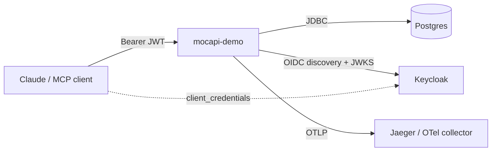
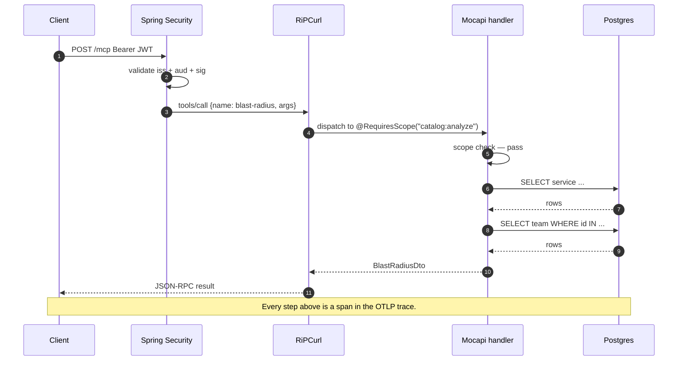

# Mocapi Demo

[](LICENSE)
[](https://github.com/callibrity/mocapi-enterprise-demo/pkgs/container/mocapi-enterprise-demo)

[](https://sonarcloud.io/summary/new_code?id=callibrity_mocapi-enterprise-demo)
[](https://sonarcloud.io/summary/new_code?id=callibrity_mocapi-enterprise-demo)
[](https://sonarcloud.io/summary/new_code?id=callibrity_mocapi-enterprise-demo)
[](https://sonarcloud.io/summary/new_code?id=callibrity_mocapi-enterprise-demo)
[](https://sonarcloud.io/summary/new_code?id=callibrity_mocapi-enterprise-demo)

An **enterprise-grade MCP server** built on Spring Boot 4, [Mocapi](https://github.com/callibrity/mocapi), and GraalVM native. Exposes a fictitious service catalog ("Meridian") over the Model Context Protocol so an LLM can answer the kinds of questions every enterprise engineering org struggles with:

- **Who owns this service?** What happens if it breaks?
- **Which services touch PII / PCI?** Are any of them orphaned?
- **What's our deprecation debt?** Which legacy services are still being called, and by whom?
- **If we sunset this team, what are we on the hook for?**

The point isn't the catalog. The point is what sits around it: OAuth2 with RFC 8707 resource indicators, scope-gated tool visibility, three-pillar OpenTelemetry, persistent sessions, native-compilable everything — the patterns real MCP deployments need but toy examples skip.

---

## Quickstart

Three commands on a fresh clone:

```bash
# 1. bring up Postgres, Keycloak (with realm pre-imported), Jaeger
docker compose up -d

# 2. run the app (generates an ephemeral session key on first boot)
mvn spring-boot:run

# 3. mint a token as the "oncall" persona, then call a tool
TOKEN=$(curl -sS -X POST http://localhost:8180/realms/mocapi-demo/protocol/openid-connect/token \
  -d 'grant_type=client_credentials&client_id=meridian-oncall&client_secret=meridian-oncall-secret' \
  | jq -r .access_token)

curl -sS -X POST http://localhost:8080/mcp \
  -H "Authorization: Bearer $TOKEN" \
  -H 'Content-Type: application/json' \
  -H 'Accept: application/json, text/event-stream' \
  -H "Mcp-Session-Id: $(uuidgen)" \
  -d '{"jsonrpc":"2.0","id":1,"method":"tools/call","params":{"name":"blast-radius","arguments":{"name":"payment-processor"}}}'
```

Traces land in Jaeger at <http://localhost:16686>. Keycloak's admin console (if you want to poke around the realm) is at <http://localhost:8180>, `admin` / `admin`.

---

## Enterprise pillars

This is the spine of what the demo is trying to show. Each pillar is a pattern enterprises actually need.

### 1. Authorization — OAuth2 + RFC 8707 + scope-gated tool visibility

The `/mcp` endpoint is a Spring Security OAuth2 resource server. Every request carries a JWT; Spring validates signature, issuer, and audience before the MCP handler runs.

Keycloak is the local OIDC provider. Its realm (pre-imported from [`keycloak/mocapi-demo-realm.json`](keycloak/mocapi-demo-realm.json)) defines:

- Three **client scopes** that gate what tools a caller can see and invoke:

  | Scope | Tools unlocked |
  |---|---|
  | `catalog:read` | `service-lookup`, `team-lookup`, `services-list`, `teams-list` |
  | `catalog:analyze` | `blast-radius`, `service-dependencies`, `service-dependents`, `orphaned-services`, `deprecated-in-use` |
  | `feedback:write` | `submit-feedback`, `suggest-tool` |

- Three **personas** (M2M clients) with tiered scope assignments:

  | Persona | Scopes | Tools visible | Real-world analog |
  |---|---|---|---|
  | `meridian-viewer` | `catalog:read` | **4** | Everyday directory user |
  | `meridian-oncall` | `+ catalog:analyze` | **9** | 2am-page responder |
  | `meridian-owner` | `+ feedback:write` | **11** | Catalog maintainer |

Tools are gated by `@RequiresScope("...")` from [`mocapi-spring-security-guards`](https://github.com/callibrity/mocapi/tree/main/mocapi-spring-security-guards). When a caller lacks the required scope, the tool is **hidden from `tools/list`** (not just 403'd on invocation) — the LLM never sees an unusable tool in its schema. Defense in depth: if a client somehow invokes a hidden tool anyway, `@RequiresScope` returns JSON-RPC `-32003 Forbidden`.

**RFC 8707 resource indicators** are supported end-to-end: the audience mapper in Keycloak binds issued tokens to `http://localhost:8080/mcp`, and Spring's resource-server validates the `aud` claim against `spring.security.oauth2.resourceserver.jwt.audiences`. This blocks the token-theft-to-other-resource attacks plain bearer tokens allow.

**Swap to a different IdP** by setting three env vars — no code change, no profile juggling:

```bash
SPRING_SECURITY_OAUTH2_RESOURCESERVER_JWT_ISSUER_URI=https://your-tenant.auth0.com/
SPRING_SECURITY_OAUTH2_RESOURCESERVER_JWT_AUDIENCES=https://mcp.yourcompany.com
SPRING_SECURITY_OAUTH2_RESOURCESERVER_JWT_JWK_SET_URI=https://your-tenant.auth0.com/.well-known/jwks.json
```

### 2. Observability — three pillars via OTLP

Traces, metrics, and logs all leave the app via OTLP. Locally, Jaeger's all-in-one (with `COLLECTOR_OTLP_ENABLED=true`) catches traces on `:4318`. In production, point at the OTel collector of your choice.

- **Traces**: Micrometer Observation → OTel bridge (via `spring-boot-starter-opentelemetry`, transitive through `mocapi-otel`). A single tool call produces a complete flame graph: `http post /mcp` → Spring Security filter chain → `tools/call` (RiPCurl dispatch) → tool span (e.g. `blast-radius`) → JDBC `connection`/`query`/`result-set` spans. N+1 query patterns are visible in the trace, not inferred from logs.
- **Metrics**: Micrometer OTLP meter registry pushes on a 60s cadence. JVM, HTTP, JDBC, Hikari, Mocapi handler metrics all flow.
- **Logs**: Logback → OTel `LogRecord` via `opentelemetry-logback-appender-1.0`, wired at boot by an explicit `OpenTelemetryAppender.install(...)`. MDC keys from `mocapi-logging` (`mcp.session`, `mcp.handler.kind`, `mcp.handler.name`) propagate as log attributes with trace/span correlation.

No OTel Java agent. No bytecode instrumentation. Works under GraalVM native without special handling.

### 3. Persistence — Postgres for everything

Two durable stores, both Postgres:

- **Catalog schema** (service, team, dependency, service_tag) — Liquibase-managed via [`src/main/resources/db/changelog/`](src/main/resources/db/changelog/). Hibernate runs in `ddl-auto=validate`, so drift between entities and schema fails startup instead of silently mutating the DB.
- **Mocapi session state** (substrate_atom, substrate_mailbox, substrate_journal_*, substrate_notifier) — managed by [`substrate-postgresql`](https://github.com/jwcarman/substrate), shares the same `DataSource`. Sessions survive app restarts; the notifier uses Postgres `LISTEN/NOTIFY` for cross-node fan-out.

Sessions are encrypted at rest with an AES-256 key. For local dev, a fresh ephemeral key is generated on boot and logged in bold red so you know you got one ([`SessionKeyBootstrap.java`](src/main/java/com/callibrity/mocapi/demo/infra/SessionKeyBootstrap.java)). For production, set `MOCAPI_SESSION_ENCRYPTION_MASTER_KEY` and the bootstrap leaves your value alone.

### 4. GraalVM native image

Full native build in ~1.5 min (`mvn -Pnative native:compile` with GraalVM 25). Resulting binary:

- ~210MB on disk, ~100MB resident after warmup
- Starts in ~150ms
- Same Postgres + OAuth2 + OTel + scope guards as the JVM build — nothing strips out under native

Reachability hints for Liquibase XSDs, substrate SQL scripts, and Hibernate's `UUID[]` loader live in [`src/main/resources/META-INF/native-image/`](src/main/resources/META-INF/native-image/).

CI builds the native image via Paketo buildpacks (`spring-boot:build-image`) and pushes to GHCR on every tagged release — see [`.github/workflows/release.yml`](.github/workflows/release.yml).

---

## Architecture

### Deployment



### Request flow (single MCP tool call)



---

## Configuration

Everything is env-var overridable. Useful ones:

| Variable | Default | Purpose |
|---|---|---|
| `MOCAPI_SESSION_ENCRYPTION_MASTER_KEY` | *ephemeral on boot* | AES-256 key (base64, 32 bytes) for session-at-rest encryption |
| `SPRING_SECURITY_OAUTH2_RESOURCESERVER_JWT_ISSUER_URI` | `http://localhost:8180/realms/mocapi-demo` | IdP issuer |
| `SPRING_SECURITY_OAUTH2_RESOURCESERVER_JWT_AUDIENCES` | `http://localhost:8080/mcp` | Expected `aud` claim value |
| `SPRING_SECURITY_OAUTH2_RESOURCESERVER_JWT_JWK_SET_URI` | `<issuer>/protocol/openid-connect/certs` | JWKS endpoint |
| `SPRING_DATASOURCE_URL` | `jdbc:postgresql://localhost:5432/mocapi-demo` | Postgres JDBC URL |
| `SPRING_DATASOURCE_USERNAME` / `_PASSWORD` | `mocapi` / `mocapi-dev` | Postgres creds |
| `MANAGEMENT_OPENTELEMETRY_TRACING_EXPORT_OTLP_ENDPOINT` | `http://localhost:4318/v1/traces` | OTLP trace endpoint |
| `MANAGEMENT_OPENTELEMETRY_METRICS_EXPORT_OTLP_ENDPOINT` | `http://localhost:4318/v1/metrics` | OTLP metrics endpoint |
| `MANAGEMENT_OPENTELEMETRY_LOGGING_EXPORT_OTLP_ENDPOINT` | `http://localhost:4318/v1/logs` | OTLP logs endpoint |
| `MANAGEMENT_TRACING_SAMPLING_PROBABILITY` | `1.0` | Trace sampling (0.0–1.0); dial down in prod |

---

## Project structure

```
src/main/java/com/callibrity/mocapi/demo/
├── MocapiDemoApplication.java          # Spring Boot entry point
├── catalog/
│   ├── domain/                         # JPA entities + enums
│   ├── repository/                     # Spring Data JPA repositories
│   ├── service/                        # transport-agnostic catalog service
│   ├── mcp/CatalogTools.java           # thin @McpTool + @RequiresScope adapter
│   ├── dto/                            # MCP-shaped return types
│   └── seed/                           # startup seed data (36 services, 8 teams, 86 deps)
├── feedback/                           # submit-feedback + suggest-tool
├── security/ActuatorSecurityConfiguration.java
└── infra/
    ├── OpenTelemetryAppenderInitializer.java   # wires logback appender to OTel SDK
    └── SessionKeyBootstrap.java                # generates ephemeral session key on dev
```

---

## What's *not* here (intentionally)

This is a demo, not a production deployment. Real deployments also need:

- **HA** — running multiple replicas. `substrate-postgresql`'s `LISTEN/NOTIFY` notifier is cross-node safe, but the session-encryption key must be shared across instances (KeyVault, Secret Manager, etc.).
- **Secret management** — the demo's Keycloak client secrets are in realm JSON. In prod, mint real secrets in KeyVault/Vault and inject as env vars.
- **Rate limiting / quotas** — nothing prevents a misbehaving LLM from exhausting your Postgres connection pool.
- **Prod-grade Keycloak** — the compose Keycloak runs in `start-dev` mode with in-memory H2. Real deployments back it with Postgres and run `start`.
- **Observability budget** — `sampling.probability=1.0` is fine for local; in prod, dial down and use tail-based sampling at the collector.

---

## Contributing

See [CONTRIBUTING.md](CONTRIBUTING.md). Everything about this project is meant to be read as a template, so if you find a pattern that's muddled, open an issue.

## License

Apache 2.0. See [LICENSE](LICENSE).
